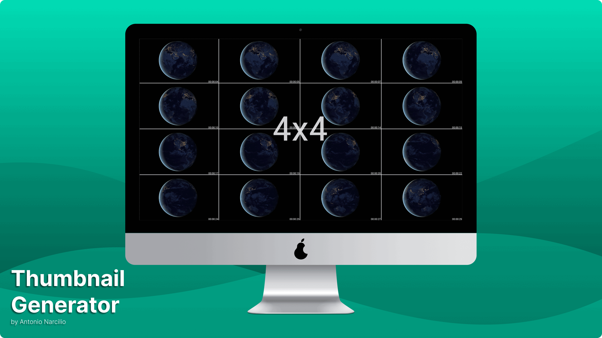

  

  <h3 align="center"><b>Gerador de miniaturas</b></h3>
  
Crie miniaturas a partir de um video de forma simples e pratica

  

  <a href=""><h5 align="center">Português Brasileiro</h5></a>
</h3>

 

## Dependências

Para que o script de geração de miniaturas funcione conforme o esperado, antes você precisar ter as seguintes dependências instaladas em sua maquina.

- `Kdialog`
  Utilizado nas notificações popup e diálogos como:  

  - Obtenção de senha de super usuário/administrador (utilizado no arquivo de instalação);  
  - Escolha da grade na geração da miniatura;

- `FFmpeg`
  Utilizado na geração das miniaturas (arquivos separados) em um intervalo de tempo...

- `ImageMagick`
  Utilizado na conversão das miniaturas separadas em um arquivo final (união dos arquivos)...

 

## Funções

- Geração de miniaturas

 

## Formatos identificados

- avi
- mp4
- m4v
- mov
- mpg
- mpeg
- wmv
- mkv
- ts
