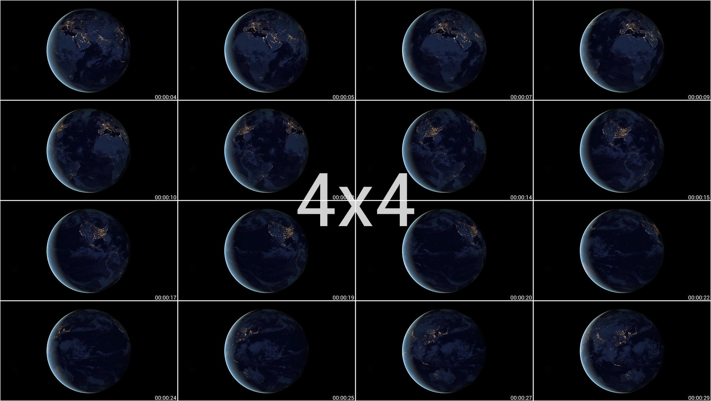

  

  <h3 align="center"><b>Thumbnail generator</b></h3>
  
Create thumbnails of a video in a simple and practical way

  

  
  
  
  
  
  
  
   
  

  

   
    
  <a href="./docs/README_pt-BR.md">Português Brasileiro 🇧🇷</a>

---

 
<h2 id="description"><b>📝 Description</b></h2>

 The development of this thumbnail generator was thinking about meeting a need I felt (or maybe yours) that not only found the generation of video thumbnails very practical, but also didn't like the final generated file.
 Searching quickly on the internet you will find several scripts or even applications like <a href="https://www.smplayer.info">SMPLAYER</a>, <a href="https://www.videolan.org">VLC</a> that generate thumbnails, but as I described before, the final file is not exactly what I want, as the file that contains the video thumbnails usually comes with information related to the resolution , size, frames...(<a href="./.github/smplayer_preview.png"> see the example </a>). Regarding the file generated by <b><i>SMPLAYER</i></b> in particular, I even developed a script that does the cropping process, removing what I don't want from the image, leaving only the video frames, but besides not being practical, because to generate a thumbnail, I need to open the video file in the program and select the option related to generating thumbnails (<i>I don't know if it has this option via the command line</i>), when trying to run this script on another machine, the expected result ends up not being exactly the same, because <b><i>SMPLAYER</i></b>, when adding the data referring to certain video information in the thumbnail, ends up using the system's default font, making the file different from the one expected , with a larger or smaller size; in case the system (<i>probably</i>) uses a different font than the one I used (in my system) when developing the clipping script.  

 Doing several researches and also as I already have a certain knowledge about the tools / technologies (<b><i>ImageMagick</i></b>, <b><i>FFmpeg</i></b> e <b><i>Kdialog</i></b>), i developed this thumbnail generation <a href="./generate_thumbnails">script</a>.

---

 
<h2 id="dependencies"><b>🚧 Dependencies</b></h2>

In order for the thumbnail generation script to work as expected, you must first have the following dependencies installed on your machine.

<h3><a href="https://apps.kde.org/kdialog/"><b>Kdialog</b></a></h3>

 
  <b>Where is it used?</b>  
  Used in pop-up notifications and dialogs such as:

  > Get superuser/administrator password (only used in installation file).

  > Grid choice in thumbnail generation.

  > Show messages (pop-up) containing information about the thumbnail generation process...

 
  <h4><b>How to install ?</b></h4>
  
  First, make sure you have kdialog installed on your machine (if you prefer, the `install.sh` file does this check for you).
  
  ~~~bash
  kdialog --version
  ~~~
  
  > 💡 If returning something other than `kdialog <version_number>` is a sign that you don't have this dependency installed on your machine, if this is exactly your situation, continue with the brief installation process below.

  Briefly, run the following command in the terminal to install the dependency:

  ##### Distros Debian
  ~~~bash
  sudo apt update && sudo apt install kdialog -y
  ~~~  
  ##### Distro Arch Linux
  ~~~bash
  sudo pacman -Sy kdialog
  ~~~

  > 💡 For more, click on the name `kdialog` (in blue) there at the beginning of the thread; where you will be redirected to the app's official page.

---

<h3><a href="https://www.ffmpeg.org/download.html"><b>FFmpeg</b></a></h3>

 
  <h4><b>Where is it used?</b></h4>   
  Used to generate thumbnails (separate files) at a time interval...

 
  <h4><b>How to install ?</b></h4>

  First, make sure you have FFmpeg installed on your machine (if you prefer, the `install.sh` file does this check for you).
  
  ~~~bash
  ffmpeg -version
  ~~~
  
  > 💡 If returning something other than `ffmpeg version <numero_da_versao> Copyright ...` is a sign that you don't have this dependency installed on your machine, if this is exactly your situation, continue with the brief installation process below.
  
  Briefly, run the following command in the terminal to install the dependency:

  ##### Distros Debian
  ~~~bash
  sudo apt update && sudo apt install ffmpeg -y
  ~~~  
  ##### Distro Arch Linux
  ~~~bash
  sudo pacman -Sy ffmpeg
  ~~~

  > 💡 For more, click on the name `FFmpeg` (in blue) there at the beginning of the thread; where you will be redirected to the app's official page.

---

<h3><a href="https://imagemagick.org/script/download.php"><b>ImageMagick</b></a></h3>

 
  <h4><b>Where is it used?</b></h4>  
  ImageMagick is a very powerful command line image manipulation tool. Here, it is used to convert the separate thumbnails into a final file (join files) and optimize it.

 
  <h4><b>How to install ?</b></h4>
  The files described above will be copied to their respective directories:
  First, make sure you have ImageMagick installed on your machine (if you prefer, the `install.sh` file does this check for you).

  ~~~bash
  convert --version
  ~~~
  
  > 💡 If returning something other than `Version: ImageMagick  <numero_da_versao> Copyright ...` is a sign that you don't have this dependency installed on your machine, if this is exactly your situation, continue with the brief installation process below.

  Briefly, run the following command in the terminal to install the dependency:

  ##### Distros Debian
  ~~~bash
  sudo apt update && sudo apt install imagemagick -y
  ~~~  
  ##### Distro Arch Linux
  ~~~bash
  sudo pacman -Sy imagemagick
  ~~~

  > 💡  For more, click on the name `ImageMagick` (in blue) there at the beginning of the thread; where you will be redirected to the app's official page.

---

 
<h2 id="recommendations"><b>👍 Recommendations</b></h2>
  I recommend using the excellent <a href="https://apps.kde.org/dolphin/"> dolphin </a> file manager, through it you can use the script via the context menu <a href="#how-to-use"> see more </a> on how to use it.

---

 
<h2 id="features"><b>🛸 Features</b></h2>

- Thumbnail generation via context menu in file manager [dolphin](https://apps.kde.org/dolphin/). [See how to use](#how-to-use).
- Thumbnail generation via command line. [See how to use](#how-to-use).
- Option to choose which structure will have the final file containing the thumbnails (4x4, 5x5, 6x6). 

 
<h2 id="format-support"><b>📽 Identified video formats</b></h2>

  By default, the following formats are identified when trying to generate a thumbnail, via the command line (terminal) or via the dolphin file manager.

  |Extensions |       |Extensions |
  |:---------:| :---: |:---------:|
  |  `.avi`   |   -   |  `.mp4`   |
  |  `.m4v`   |   -   |  `.mov`   |
  |  `.mpg`   |   -   |  `.mpeg`  |
  |  `.wmv`   |   -   |  `.mkv`   |
  |  `.ts`    |   -   |           |
  
   

> 💡 In the dolphin file manager, for example, the "shortcut" in the context menu will only appear if you select a video that has one of the extensions specified above. Read more at, [how to use](#how-to-use)

---

 
<h2 id="install"><b>🚀 Install</b></h2>

  Installation is very simple, just run the install script (`install.sh`) and it will do the rest for you, but pay attention to the initial setup 👇.

 
  <h4><b>Initial setting</b></h4>
  Before running the installation file <i>install.sh</i>, you need permission to run it. There are two ways to go about this process.

  1. Via dolphin file manager (graphical interface):
  Right-click the `install.sh` file and select <kbd> properties </kbd>> <kbd> permissions </kbd> and check the `is executable` box.    
      

  2. Via command line (terminal):

      ~~~bash
      chmod +x ./install.sh
      ~~~

 
 
  <h4><b>How to use?</b></h4>
  There are also two ways to run the script:  

  1. Via dolphin file manager (graphical interface):
  Double-click the `install.sh` file.    
      

  2. Via command line (terminal):
       ~~~bash
       ./install.sh
      ~~~

  After running the `install.sh` file, a dialog box asking for the superuser / administrator password will appear, pass the password to proceed with the installation process.    
  

  The script will check if all dependencies are installed, if the return is positive it will continue with the installation process, at the end of the process if everything goes as expected, a pop-up will appear informing you that the installation was successful. Otherwise, a message (pop-up) will appear informing you of the error found.    
  

 

 
 
  <h4><b>What does this script do ?</b></h4>
  This script is to automate the "installation" process of the thumbnail generator
 

 
 
  <h4><b>What types of files will be installed ?</b></h4>
  In fact, it will copy the following files, all found in the repository.

  ~~~
  .
  ├── emojis
  │   ├── emoji_u1f389.svg
  │   ├── emoji_u1f39e.svg
  │   ├── emoji_u1f3ac.svg
  │   ├── emoji_u1f5bc.svg
  │   ├── emoji_u1f9d9_1f3fc_200d_2642.svg
  │   └── emoji_u1f9e9.svg
  ├── fonts
  │   └── Roboto-Regular.ttf
  ├── generate_thumbnails
  ├── generate-thumbnails.desktop
  └── icons
      ├── an-alert.svg
      ├── an-edition.svg
      ├── an-effects.svg
      ├── an-error.svg
      ├── an-scripts.svg
      └── an-utilities.svg
  ~~~

 

 
 
  <h4><b>Where will these files be copied to ?</b></h4>
  The files described above will be copied to their respective directories:

  <kbd>usr</kbd> > <kbd>share</kbd> > <kbd>pixmaps</kbd>

  ~~~
  .
  ├── emojis
  │   ├── emoji_u1f389.svg
  │   ├── emoji_u1f39e.svg
  │   ├── emoji_u1f3ac.svg
  │   ├── emoji_u1f5bc.svg
  │   ├── emoji_u1f9d9_1f3fc_200d_2642.svg
  │   └── emoji_u1f9e9.svg
  └── icons
      ├── an-alert.svg
      ├── an-edition.svg
      ├── an-effects.svg
      ├── an-error.svg
      ├── an-scripts.svg
      └── an-utilities.svg
  ~~~

  <kbd>usr</kbd> > <kbd>local</kbd> > <kbd>share</kbd> > <kbd>fonts</kbd> > <kbd>r</kbd>

  ~~~
  .
  └── fonts
      └── Roboto-Regular.ttf
  ~~~

  <kbd>usr</kbd> > <kbd>bin</kbd>

  ~~~
  .
  └── generate_thumbnails
  ~~~

  <kbd>home</kbd> > <kbd>user_name</kbd> > <kbd>.local</kbd> > <kbd>share</kbd> > <kbd>kservices5</kbd> > <kbd>ServiceMenus</kbd>

  ~~~
  .
  └── generate-thumbnails.desktop
  ~~~

 

---

 
<h2 id="how-to-use"><b>🤔 How to use?</b></h2>
There are two ways to generate thumbnails related to a specific video, through the context menu of the file manager <a href="https://apps.kde.org/dolphin/"> dolphin </a> or through the line command (terminal).

 
<h4><b>Through the dolphin file manager</b></h4>

1. Right click on the video you want to generate the thumbnail to open the context menu, an option called `Generate thumbnails` will appear, click on it.    
    

2. A dialog will appear asking whether or not you want to continue, click yes.    
    

3. Then another successful dialog asking which grid the final file will have, select an option. (for more see: [final result](#options))

    
  
  
4. If everything goes as expected, a pop-up will appear informing you that the thumbnail was successfully generated and also the path where it was saved, clicking on the path (link) the image will open in the default image viewer.    
    

 
<h4><b>Through the command line (terminal)</b></h4>
If you want to generate the thumbnails via the command line, just run the command

~~~bash
$ generate_thumbnails "caminho/nome_do_arquivo_de_video"
~~~

With that, just follow the same step-by-step described above in the generation of thumbnails by the dolphin file manager

---

 
<h2 id="final"><b>🥳 Expected result</b></h2>
 
 
 The files generated during the thumbnail creation process are saved in the directory:  
 <kbd>tmp</kbd> > <kbd>thumbnails-file_name-random_number</kbd> (<b>removed on system restart</b>) 
 The final file will be saved in the same directory where the selected video is located.

   

 <h4 id="options"><b>Thumbnail options</b></h4>

 |Grid|Final file|
 |:-------:|:-------:|
 | 4x4 ||
 | 5x5 ||
 | 6x6 ||

 

---

 
<h2 id="license"><b>📜 License</b></h2>

This project is under license [MIT](./LICENSE)

---

  

 
created by <a href="https://linkedin.com/in/antonionarcilio">@antonionarcilio</a>

