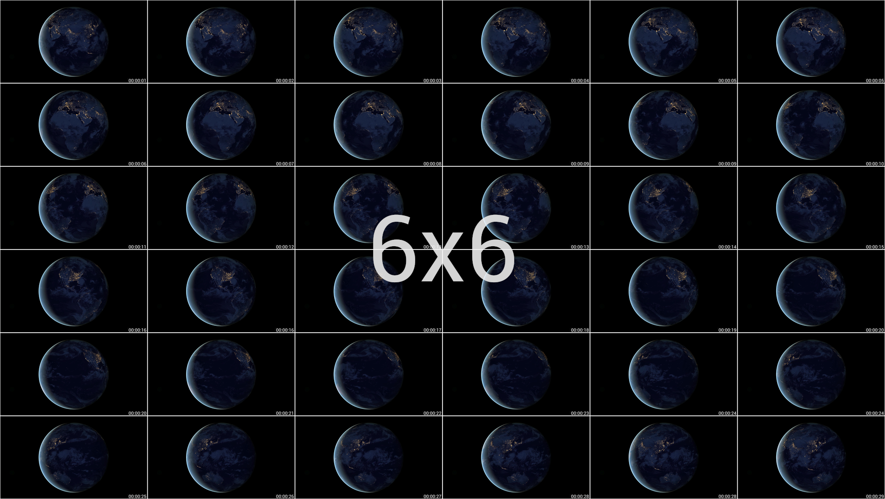

  

  <h3 align="center"><b>Thumbnail generator</b></h3>
  
Create thumbnails of a video in a simple and practical way

  

  
  
  
  
  
  
  
   
  

  

   
    
  <a href="./docs/README_pt-BR.md">Português Brasileiro 🇧🇷</a>

---

 
<h2 id="description"><b>📝 Description</b></h2>

 The development of this thumbnail generator was thinking about meeting a need I felt (or maybe yours) that not only found the generation of video thumbnails very practical, but also didn't like the final generated file.
 Searching quickly on the internet you will find several scripts or even applications like <a href="https://www.smplayer.info">SMPLAYER</a>, <a href="https://www.videolan.org">VLC</a> that generate thumbnails, but as I described before, the final file is not exactly what I want, as the file that contains the video thumbnails usually comes with information related to the resolution , size, frames...(<a href="./.github/smplayer_preview.png"> see the example </a>). Regarding the file generated by <b><i>SMPLAYER</i></b> in particular, I even developed a script that does the cropping process, removing what I don't want from the image, leaving only the video frames, but besides not being practical, because to generate a thumbnail, I need to open the video file in the program and select the option related to generating thumbnails (<i>I don't know if it has this option via the command line</i>), when trying to run this script on another machine, the expected result ends up not being exactly the same, because <b><i>SMPLAYER</i></b>, when adding the data referring to certain video information in the thumbnail, ends up using the system's default font, making the file different from the one expected , with a larger or smaller size; in case the system (<i>probably</i>) uses a different font than the one I used (in my system) when developing the clipping script.  

 Doing several researches and also as I already have a certain knowledge about the tools / technologies (<b><i>ImageMagick</i></b>, <b><i>FFmpeg</i></b> e <b><i>Kdialog</i></b>), i developed this thumbnail generation <a href="./generate_thumbnails">script</a>.

---

 
<h2 id="dependencies"><b>🚧 Dependencies</b></h2>

Para que o script de geração de miniaturas funcione conforme o esperado, antes você precisar ter as seguintes dependências instaladas em sua maquina.

<h3><a href="https://apps.kde.org/kdialog/"><b>Kdialog</b></a></h3>

 
  <b>Where is it used?</b>  
  Utilizado nas notificações popup e em diálogos como:

  > Obtenção de senha de super usuário/administrador (utilizado no arquivo de instalação);

  >Escolha da grade na geração da miniatura;

  >Mostra mensagens (popup) contendo informações sobre o processo de geração das miniaturas ...

 
  <h4><b>How to install ?</b></h4>
  Primeiro verifique se você possui o kdialog instalado em sua maquina (se preferir o arquivo `install.sh` faz essa verificação para você).
  
  ~~~bash
  kdialog --version
  ~~~
  
  > 💡 Se retornar algo diferente `kdialog <numero_da_versao>` é sinal que você não tem tal dependência instalada em sua maquina se for o caso siga para o proximo passo.

  Não irei me aprofundar muito nessa questão pois existe "outras formas de se instalar tal" aplicação, mais de forma bem sucinta execute no terminal um dos comandos:

  ##### Distros Debian
  ~~~bash
  sudo apt update
  ~~~
  ~~~bash
  sudo apt install kdialog -y
  ~~~
  >ou simplificando
  ~~~bash
  sudo apt update && sudo apt install kdialog -y
  ~~~  
  ##### Distro Arch Linux
  ~~~bash
  $ sudo pacman -Sy kdialog
  ~~~

  > 💡 Para mais, clique no nome `kdialog` (em azul) lá no inicio do tópico; onde você será redirecionado para a pagina oficial da aplicação.

---

<h3><a href="https://www.ffmpeg.org/download.html"><b>FFmpeg</b></a></h3>

 
  <h4><b>Where is it used?</b></h4>   
  Utilizado na geração das miniaturas (arquivos separados) em um intervalo de tempo...

 
  <h4><b>How to install ?</b></h4>
  Primeiro verifique se você possui o ffmpeg instalado em sua maquina (se preferir o arquivo `install.sh` faz essa verificação para você).
  
  ~~~bash
  ffmpeg -version
  ~~~
  
  > 💡 Se retornar algo diferente `ffmpeg version <numero_da_versao> Copyright ...` é sinal que você não tem tal dependência instalada em sua maquina se for o caso siga para o proximo passo.
  
  Conforme descrito no processo de instalação do kdialog, faço a mesma citação aqui [...] Execute no terminal um dos comandos:

  ##### Distros Debian
  ~~~bash
  sudo apt update
  ~~~
  ~~~bash
  sudo apt install ffmpeg -y
  ~~~
  > ou simplificando
  ~~~bash
  sudo apt update && sudo apt install ffmpeg -y
  ~~~  
  ##### Distro Arch Linux
  ~~~bash
  $ sudo pacman -Sy ffmpeg
  ~~~

  > 💡 Para mais, clique no nome `FFmpeg` (em azul) lá no inicio do tópico; onde você será redirecionado para a pagina oficial da aplicação.

---

<h3><a href="https://imagemagick.org/script/download.php"><b>ImageMagick</b></a></h3>

 
  <h4><b>Where is it used?</b></h4>  
  O ImageMagick é uma ferramenta de manipulação de imagem via linha de comando poderosíssima. Aqui ele/ela é utilizado na conversão das miniaturas separadas em um arquivo final (união dos arquivos) e otimização do mesmo.

 
  <h4><b>How to install ?</b></h4>
  Primeiro verifique se você possui o imagemagick instalado em sua maquina (se preferir o arquivo `install.sh` faz essa verificação para você).

  ~~~bash
  convert --version
  ~~~
  
  > 💡 Se retornar algo diferente `Version: ImageMagick  <numero_da_versao> Copyright ...` é sinal que você não tem tal dependência instalada em sua maquina se for o caso siga para o proximo passo.

  Conforme descrito nos dois processo de instalação anteriormente, faço a mesma citação aqui [...] Execute no terminal um dos comandos:

  ##### Distros Debian
  ~~~bash
  sudo apt update
  ~~~
  ~~~bash
  sudo apt install imagemagick -y
  ~~~
  > ou simplificando
  ~~~bash
  sudo apt update && sudo apt install imagemagick -y
  ~~~  
  ##### Distro Arch Linux
  ~~~bash
  $ sudo pacman -Sy imagemagick
  ~~~

  > 💡 Para mais, clique no nome `ImageMagick` (em azul) lá no inicio do tópico; onde você será redirecionado para a pagina oficial da aplicação.

---

 
<h2 id="recommendations"><b>👍 Recommendations</b></h2>
Recomendo utilizar o excelente gerenciador de arquivos <a href="https://apps.kde.org/dolphin/">dolphin</a>, pois através dele você poderá utilizar o script via menu de contexto <a href="#how-to-use">veja mais</a> em como utilizar.

---

 
<h2 id="features"><b>🛸 Features</b></h2>

- Geração de miniaturas via linha de comando. [Veja como usar](#how-to-use).
- Geração de miniaturas via menu de contexto no gerenciador de arquivos [dolphin](https://apps.kde.org/dolphin/). [Veja como usar](#how-to-use).
- Opção de escolha entre qual grade o arquivo final contendo as miniaturas terá. 

 
<h2 id="format-support"><b>📽 Formatos de video identificados</b></h2>

  Por padrão os seguintes formatos são identificados ao tentar gerar uma miniatura, via linha de comando (terminal) ou pelo gerenciador de arquivo dolphin.

  | Extensões |       | Extensões |
  |:---------:| :---: |:---------:|
  |  `.avi`   |   -   |  `.mp4`   |
  |  `.m4v`   |   -   |  `.mov`   |
  |  `.mpg`   |   -   |  `.mpeg`  |
  |  `.wmv`   |   -   |  `.mkv`   |
  |  `.ts`    |   -   |           |
  
   

> 💡 No gerenciador de arquivo dolphin por exemplo o "atalho" no menu de contexto so aparecerá se você selecionar um video que tenha uma dessa extensões especificadas acima. Leia mais em [como usar](#how-to-use)

---

 
<h2 id="install"><b>🚀 Install</b></h2>

A instalação é algo bem simples, basta executar o script de instalação ( `install.sh` ) que ele fará o resto para você, mas antes se atente na configuração inicial 👇.

 
  <h4><b>Initial setting</b></h4>
  Antes de executar o arquivo de instalação <i>install.sh</i>, você precisa da permissão para execução do mesmo. Existe duas formas de se fazer esse processo.

  1. Via gerenciador de arquivo (interface gráfica):
  Clique com o botão direito do mouse no arquivo `install.sh` selecione <kbd>propriedades</kbd> > <kbd>permissões</kbd> marque a caixa de `é executável`.  
      

  2. Via linha de comando (terminal):

      ~~~bash
      chmod +x ./install.sh
      ~~~

 
 
  <h4><b>How to use?</b></h4>
  Exite duas formas de se executar o script: 

  1. Via gerenciador de arquivo (interface gráfica):
  Dê duplo clique no arquivo `install.sh`.  
      

  2. Via linha de comando (terminal)
       ~~~bash
       ./install.sh
      ~~~

  Após executar o arquivo `install.sh` um dialogo pedindo a senha de super usuário / administrador aparecerá, passe a senha para prosseguir com o processo de instalação.  
  

  O script irá verificar se todas as dependências então instaladas e caso o retorno sege positivo ele continuará com o processo de instalação, se tudo ocorrer conforme o esperado um popup irá aparecer informando que a instalação foi bem sucedida.  
  

 

 
 
  <h4><b>What does this script do ?</b></h4>
  Esse script serve para automatizar o processo de "instalação" dos arquivos que o gerador de miniaturas utilizados/depende.
 

 
 
  <h4><b>What types of files will be installed ?</b></h4>
  Na verdade ele irá copiar os seguintes arquivos todos encontrados no repositório.

  ~~~
  .
  ├── emojis
  │   ├── emoji_u1f389.svg
  │   ├── emoji_u1f39e.svg
  │   ├── emoji_u1f3ac.svg
  │   ├── emoji_u1f5bc.svg
  │   ├── emoji_u1f9d9_1f3fc_200d_2642.svg
  │   └── emoji_u1f9e9.svg
  ├── fonts
  │   └── Roboto-Regular.ttf
  ├── generate_thumbnails
  ├── generate-thumbnails.desktop
  └── icons
      ├── an-alert.svg
      ├── an-edition.svg
      ├── an-effects.svg
      ├── an-error.svg
      ├── an-scripts.svg
      └── an-utilities.svg
  ~~~

 

 
 
  <h4><b>Where will these files be copied to ?</b></h4>
  Os arquivo descritos anteriormente serão copiados para os respectivos diretórios:

  <kbd>usr</kbd> > <kbd>share</kbd> > <kbd>pixmaps</kbd>

  ~~~
  .
  ├── emojis
  │   ├── emoji_u1f389.svg
  │   ├── emoji_u1f39e.svg
  │   ├── emoji_u1f3ac.svg
  │   ├── emoji_u1f5bc.svg
  │   ├── emoji_u1f9d9_1f3fc_200d_2642.svg
  │   └── emoji_u1f9e9.svg
  └── icons
      ├── an-alert.svg
      ├── an-edition.svg
      ├── an-effects.svg
      ├── an-error.svg
      ├── an-scripts.svg
      └── an-utilities.svg
  ~~~

  <kbd>usr</kbd> > <kbd>local</kbd> > <kbd>share</kbd> > <kbd>fonts</kbd> > <kbd>r</kbd>

  ~~~
  .
  └── fonts
      └── Roboto-Regular.ttf
  ~~~

  <kbd>usr</kbd> > <kbd>bin</kbd>

  ~~~
  .
  └── generate_thumbnails
  ~~~

  <kbd>home</kbd> > <kbd>usuario</kbd> > <kbd>.local</kbd> > <kbd>share</kbd> > <kbd>kservices5</kbd> > <kbd>ServiceMenus</kbd>

  ~~~
  .
  └── generate-thumbnails.desktop
  ~~~

 

---

 
<h2 id="how-to-use"><b>🤔 How to use?</b></h2>
Existe duas formas de gerar miniaturas relacionadas a um video em especifico, ou via menu de contexto através do <a href="https://apps.kde.org/dolphin/">dolphin</a> ou via linha de comando (terminal).

 
<h4><b>Through the dolphin file manager</b></h4>

1. Clique com o botão direito do mouse no video que você deseja gerar a miniatura, no menu de contexto que abrir irá aparecer uma opção chamada `Generate thumbnails` clique nela.  
    

2. Irá aparecer um dialogo perguntando se você deseja ou não continuar com clique em sim (yes no meu caso).  
    
  
3. Caso tudo ocorra conforme o esperado um popup ira aparecer informando que a miniatura foi gerada com sucesso e também o caminho onde ela foi salva ao clicar no link a imagem será aberta no visualizador de imagem padrão.  
    

 
<h4><b>Through the command line (terminal)</b></h4>
Caso queira gerar as miniaturas via linha de comando basta executa o comando

~~~bash
$ generate_thumbnails "caminho/nome_do_arquivo_de_video"
~~~

---

 
<h2 id="final"><b>🥳 Expected result</b></h2>
 
 
 Os arquivos gerados durante o processo de criação das miniaturas, são salvos no diretório:  
 <kbd>tmp</kbd> > <kbd>thumbnails-nome_do_arquivo-numero_aleatório</kbd> (<b>removido ao reiniciar o sistema</b>) 
 Já o arquivo final será salvo no mesmo diretório no qual se encontra o video escolhido para gerar as miniaturas.

 |Grid|Final file|
 |:-------:|:-------:|
 | 4x4 ||
 | 5x5 ||
 | 6x6 ||

 

---

 
<h2 id="license"><b>📜 License</b></h2>

This project is under license [MIT](./LICENSE)

---

  

 
created by <a href="https://linkedin.com/in/antonionarcilio">@antonionarcilio</a>

