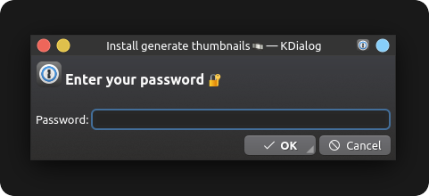
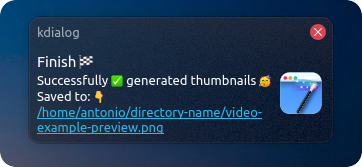

  

  <h3 align="center"><b>Gerador de miniaturas</b></h3>
  
Crie miniaturas a partir de um vídeo de forma simples e prática

  

  
  
  
  
  
  
  
  
   
  

  

   

---

 
<h2 id="description"><b>📝 Descrição</b></h2>

 O desenvolvimento desse gerador de miniaturas foi pensando em suprir uma necessidade vivida pela minha pessoa (ou talvez quem sabe uma necessidade sua) que não só achava nada prático a geração de miniaturas de um vídeo como também o arquivo de miniaturas final não me agradava.  
 Fazendo pesquisas pela internet a fundo você encontra diversos script ou até mesmo aplicações como <a href="https://www.smplayer.info">SMPLAYER</a>, <a href="https://www.videolan.org">VLC</a> que geram miniaturas, porém como dito anteriormente o arquivo final não é exatamente o que eu gostaria em ter, isso por que o arquivo contendo as miniaturas do video, geralmente vem com informações relacionada ao mesmo como resolução, tamanho ... (<a href="../.github/smplayer_preview.png"> veja o exemplo </a>). Em relação ao arquivo gerado pelo <b><i>SMPLAYER</i></b> em específico eu até cheguei a desenvolver um script que faz o processo de corte, removendo o que eu não quero da imagem deixando apenas os quadros do vídeo, porém além de não ser nada pratico já que para gerar a miniatura eu tenho que abrir o video no programa e selecionar a opção de geração de miniaturas (<i>se tiver via linha de comando eu desconheço</i>), ao tentar executar esse script de corte em outra máquina, o resultado obtido não era exatamente o mesmo, isso por que o <b><i>SMPLAYER</i></b> ao adicionar as informações na miniatura ele usar a fonte padrão do sistema, levando assim a uma certa diferença de tamanho do arquivo final em caso de o sistema utilizar (<i>provavelmente</i>) uma fonte diferente daquela que eu utilizei ao desenvolver o script de corte. 
 Então fazendo diversas pesquisa e também como eu já possuo um certo conhecimento em relação a ambas ferramentas/tecnologias (<b><i>ImageMagick</i></b>, <b><i>FFmpeg</i></b> e <b><i>Kdialog</i></b>) eu desenvolvi esse <a href="../generate_thumbnails">script</a> de geração de miniaturas.

---

 
<h2 id="dependencies"><b>🚧 Dependências</b></h2>
 Para que o script de geração de miniaturas funcione conforme o esperado, antes você precisa ter as seguintes dependências instaladas em sua máquina.
 
<h3><a href="https://apps.kde.org/kdialog/"><b>Kdialog</b></a></h3>

 <b>Onde é utilizado ?</b>  
 Utilizado nas notificações pop up e em diálogos como:
 
 > Obtenção de senha de super usuário/administrador (utilizado no arquivo de instalação);
 
 > Escolha da grade na geração da miniatura;
 
 > Mostra mensagens (pop up) contendo informações sobre o processo de geração das miniaturas ...

 

 <h4><b>Como instalar ?</b></h4>
 Primeiro verifique se você possui o kdialog instalado em sua máquina (se preferir o arquivo `install.sh` faz essa verificação para você).
 
 ~~~bash
 kdialog --version
 ~~~

 > 💡 Se retornar algo diferente `kdialog <numero_da_versao>` é sinal que você não tem tal dependência instalada em sua máquina se for o caso siga para o próximo passo.
 
 Não irei me aprofundar muito nessa questão pois existe "outras formas de se instalar tal" aplicação, mais de forma bem sucinta execute no terminal um dos comandos:
 

  ##### Distros Debian
  ~~~bash
  sudo apt update
  ~~~
  ~~~bash
  sudo apt install kdialog -y
  ~~~
  >ou simplificando
  ~~~bash
  sudo apt update && sudo apt install kdialog -y
  ~~~  
  ##### Distro Arch Linux
  ~~~bash
  $ sudo pacman -Sy kdialog
  ~~~

 > 💡 Para mais, clique no nome `kdialog` (em azul) lá no início do tópico; onde você será redirecionado para a página oficial da aplicação.

---
<h4><b>Onde é utilizado ?</b></h4>
 O ImageMagick é uma ferramenta de manipulação de imagem via linha de comando poderosíssima. Aqui ele/ela é utilizado na conversão das miniaturas separadas em um arquivo final (união dos arquivos) e otimização do mesmo.

<h4><b>Como instalar ?</b></h4>
 Primeiro verifique se você possui o imagemagick instalado em sua máquina (se preferir o arquivo `install.sh` faz essa verificação para você).

 ~~~bash
 convert --version
 ~~~
 
 > 💡 Se retornar algo diferente `Version: ImageMagick  <numero_da_versao> Copyright ...` é sinal que você não tem tal dependência instalada em sua máquina se for o caso siga para o próximo passo.

 Conforme descrito nos dois processos de instalação anteriormente, faço a mesma citação aqui [...] Execute no terminal um dos comandos:

##### Distros Debian
~~~bash
sudo apt update
~~~
~~~bash
sudo apt install imagemagick -y
~~~
> ou simplificando
~~~bash
sudo apt update && sudo apt install imagemagick -y
~~~
##### Distro Arch Linux
~~~bash
$ sudo pacman -Sy imagemagick
~~~
> 💡 Para mais, clique no nome `ImageMagick` (em azul) lá no início do tópico; onde você será redirecionado para a página oficial da aplicação.

 
---
 
 
<h2 id="recommendations"><b>👍 Recomendações</b></h2>
Recomendo utilizar o excelente gerenciador de arquivos <a href="https://apps.kde.org/dolphin/">dolphin</a>, pois através dele você poderá utilizar o script via menu de contexto <a href="#how-to-use">veja mais</a> em como utilizar.
 
---
 
 
<h2 id="features"><b>🛸 Funcionalidades</b></h2>
 
- Geração de miniaturas via linha de comando. [Veja como usar](#how-to-use).
- Geração de miniaturas via menu de contexto no gerenciador de arquivos [dolphin](https://apps.kde.org/dolphin/). [Veja como usar](#how-to-use).
- Opção de escolha entre qual grade o arquivo final contendo as miniaturas terá.
 
 
<h2 id="format-support"><b>📽 Formatos de vídeo identificados</b></h2>
 
 Por padrão os seguintes formatos são identificados ao tentar gerar uma miniatura, via linha de comando (terminal) ou pelo gerenciador de arquivo dolphin.

  | Extensões |       | Extensões |
  |:---------:| :---: |:---------:|
  |  `.avi`   |   -   |  `.mp4`   |
  |  `.m4v`   |   -   |  `.mov`   |
  |  `.mpg`   |   -   |  `.mpeg`  |
  |  `.wmv`   |   -   |  `.mkv`   |
  |  `.ts`    |   -   |           |
  
   

> 💡 No gerenciador de arquivo dolphin por exemplo o "atalho" no menu de contexto só aparecerá se você selecionar um vídeo que tenha uma dessa extensões especificadas acima. Leia mais em [como usar](#how-to-use)

---

 
<h2 id="install"><b>🚀 Instalação</b></h2>

A instalação é algo bem simples, basta executar o script de instalação ( `install.sh` ) que ele fará o resto para você, mas antes se atente na configuração inicial 👇.

 
  <h4><b>Configuração inicial</b></h4>
  Antes de executar o arquivo de instalação <i>install.sh</i>, você precisa da permissão para execução do mesmo. Existe duas formas de se fazer esse processo.

  1. Via gerenciador de arquivo (interface gráfica):
  Clique com o botão direito do mouse no arquivo `install.sh` selecione <kbd>propriedades</kbd> > <kbd>permissões</kbd> marque a caixa de `é executável`.  
      

  2. Via linha de comando (terminal):

      ~~~bash
      chmod +x ./install.sh
      ~~~

 
 
  <h4><b>Como usar ?</b></h4>
  Exite duas formas de se executar o script: 

  1. Via gerenciador de arquivo (interface gráfica):
  Dê duplo clique no arquivo `install.sh`.  
      

  2. Via linha de comando (terminal)
       ~~~bash
       ./install.sh
      ~~~

  Após executar o arquivo `install.sh` um diálogo pedindo a senha de super usuário / administrador aparecerá, passe a senha para prosseguir com o processo de instalação.  
  

  O script irá verificar se todas as dependências estão instaladas e caso o retorno seja positivo ele continuará com o processo de instalação, se tudo ocorrer conforme o esperado um popup irá aparecer informando que a instalação foi bem sucedida.  
  

 

 
 
  <h4><b>O que esse script faz ?</b></h4>
  Esse script serve para automatizar o processo de "instalação" dos arquivos que o gerador de miniaturas utiliza/depende.
 

 
 
  <h4><b>Quais tipos de arquivos ele irá instalar ?</b></h4>
  Na verdade ele irá copiar os seguintes arquivos todos encontrados no repositório.

  ~~~
  .
  ├── emojis
  │   ├── emoji_u1f389.svg
  │   ├── emoji_u1f39e.svg
  │   ├── emoji_u1f3ac.svg
  │   ├── emoji_u1f5bc.svg
  │   ├── emoji_u1f9d9_1f3fc_200d_2642.svg
  │   └── emoji_u1f9e9.svg
  ├── fonts
  │   └── Roboto-Regular.ttf
  ├── generate_thumbnails
  ├── generate-thumbnails.desktop
  └── icons
      ├── an-alert.svg
      ├── an-edition.svg
      ├── an-effects.svg
      ├── an-error.svg
      ├── an-scripts.svg
      └── an-utilities.svg
  ~~~

 

 
 
  <h4><b>Para onde esses arquivos serão copiados ?</b></h4>
  Os arquivo descritos anteriormente serão copiados para os respectivos diretórios:

  <kbd>usr</kbd> > <kbd>share</kbd> > <kbd>pixmaps</kbd>

  ~~~
  .
  ├── emojis
  │   ├── emoji_u1f389.svg
  │   ├── emoji_u1f39e.svg
  │   ├── emoji_u1f3ac.svg
  │   ├── emoji_u1f5bc.svg
  │   ├── emoji_u1f9d9_1f3fc_200d_2642.svg
  │   └── emoji_u1f9e9.svg
  └── icons
      ├── an-alert.svg
      ├── an-edition.svg
      ├── an-effects.svg
      ├── an-error.svg
      ├── an-scripts.svg
      └── an-utilities.svg
  ~~~

  <kbd>usr</kbd> > <kbd>local</kbd> > <kbd>share</kbd> > <kbd>fonts</kbd> > <kbd>r</kbd>

  ~~~
  .
  └── fonts
      └── Roboto-Regular.ttf
  ~~~

  <kbd>usr</kbd> > <kbd>bin</kbd>

  ~~~
  .
  └── generate_thumbnails
  ~~~

  <kbd>home</kbd> > <kbd>usuario</kbd> > <kbd>.local</kbd> > <kbd>share</kbd> > <kbd>kservices5</kbd> > <kbd>ServiceMenus</kbd>

  ~~~
  .
  └── generate-thumbnails.desktop
  ~~~

 

---

 
<h2 id="how-to-use"><b>🤔 Como usar ?</b></h2>
Existe duas formas de gerar miniaturas relacionadas a um vídeo em especifico, ou via menu de contexto através do <a href="https://apps.kde.org/dolphin/">dolphin</a> ou via linha de comando (terminal).

 
<h4><b>Através do gerenciador de arquivo dolphin</b></h4>

1. Clique com o botão direito do mouse no vídeo que você deseja gerar a miniatura, no menu de contexto que abrir irá aparecer uma opção chamada `Generate thumbnails` clique nela.  
    

2. Irá aparecer um diálogo perguntando se você deseja ou não continuar com clique em sim (yes no meu caso).  
    
  
3. Caso tudo ocorra conforme o esperado um popup ira aparecer informando que a miniatura foi gerada com sucesso e também o caminho onde ela foi salva ao clicar no link a imagem será aberta no visualizador de imagem padrão.  
    

 
<h4><b>Via linha de comando</b></h4>
Caso queira gerar as miniaturas via linha de comando basta executar o comando

~~~bash
$ generate_thumbnails "caminho/nome_do_arquivo_de_video"
~~~

---

 
<h2 id="final"><b>🥳 Resultado final</b></h2>
 
 
 Os arquivos gerados durante o processo de criação das miniaturas, são salvos no diretório:  
 <kbd>tmp</kbd> > <kbd>thumbnails-nome_do_arquivo-numero_aleatório</kbd> (<b>removido ao reiniciar o sistema</b>) 
 Já o arquivo final será salvo no mesmo diretório no qual se encontra o vídeo escolhido para gerar as miniaturas.

 |Grade|Arquivo final|
 |:-------:|:-------:|
 | 4x4 ||
 | 5x5 ||
 | 6x6 ||

 

---

 
<h2 id="license"><b>📜 Licença</b></h2>

Esse projeto esta sob a licença [MIT](../LICENSE)

---

  

 
criado por <a href="https://linkedin.com/in/antonionarcilio">@antonionarcilio</a>

